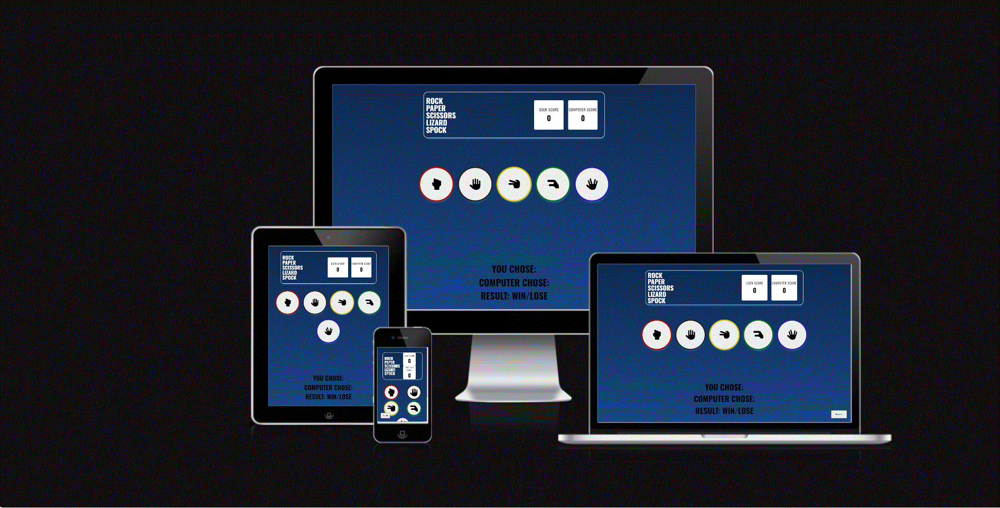
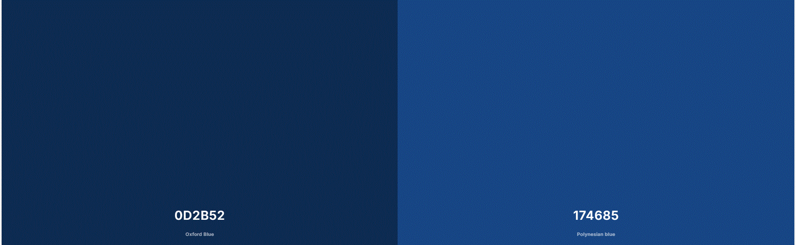
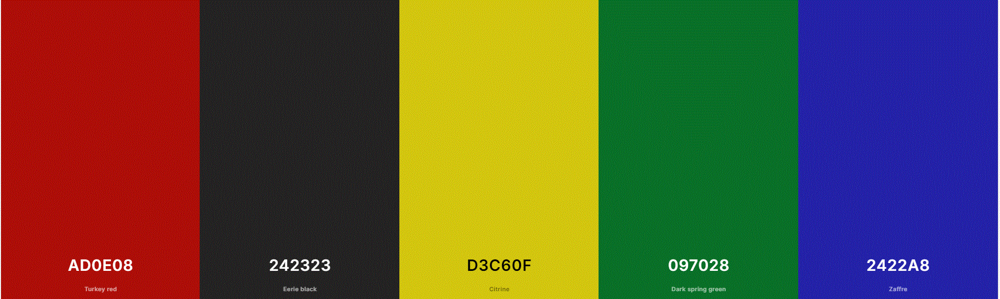

# Rock Paper Scissors Lizard Spock #

## Description ##

The game Rock Paper Scissors Lizard Spock is an expanded iteration of the traditional hand game Rock Paper Scissors. Popularized by the TV show "The Big Bang Theory," it introduces two additional choices—Lizard and Spock—to the original three (Rock, Paper, and Scissors), elevating it to a more intricate and strategic game.

## Game Rules ##

### Understanding the Game ###

**Objective:** The game is played by both the user and the computer. The idea is to outsmart the computer by choosing a hand that outperforms its own.

**Choices:** You can choose one of five hands: Rock, Paper, Scissors, Lizard, or Spock.

**Winning Rules:**
- Rock crushes Scissors and crushes Lizard.
- Paper covers Rock and disproves Spock.
- Scissors cuts Paper and decapitates Lizard.
- Lizard eats Paper and poisons Spock.
- Spock smashes Scissors and vaporizes Rock.

### Starting the Game ###

- **Access the Game:** Open the web page containing the Rock Paper Scissors Lizard Spock game.
- **View Scores:** At the top of the game screen, you will see your score and the computer's score.
- **Select a move:** Click on one of the five buttons representing your choice:

### Gamplay ###

- **Computer’s Choice:** After you select your choice, the computer will randomly choose one of the five options.
- **Result Display:** The game will generate:

  - Your Choice: What you selected.
  - Computer's Choice: What the computer selected.
  - Result: Whether you won, lost, or tied.
  
### Winning the Game ###
- The game continues until either you or the computer reaches a score of 5.
- End of Game: When someone wins, a game over message will appear.

## User Experience ##

## Project Goals ##

- Design an intuitive interface that is easy to use.
- Improve the user experience by providing visual feedback for each action (button clicks, game results) to make the game more engaging.
- Mobile Compatibility: Make sure the game is responsive and playable on a variety of devices, including phones, tablets, and computers.

## Target Audience ##

- Casual players seeking an easy-to-learn game to pass the time.
- Fans of the original “Big Bang Theory” reference and those who appreciate quirky, pop culture-inspired games.

## Design ##

### **Colours** ###

**Background Gradient:**

- Dark Blue: #0d2b52
- Lighter Blue: #174685
- 

**Buttons:**

- White: #ffffff (used for score containers)
- Red: #ad0e08 (for the rock button)
- Black: #242323 (for the paper button)
- Yellow: #d3c60f (for the scissors button)
- Green: #097028 (for the lizard button)
- Blue: #2422a8 (for the Spock button)

